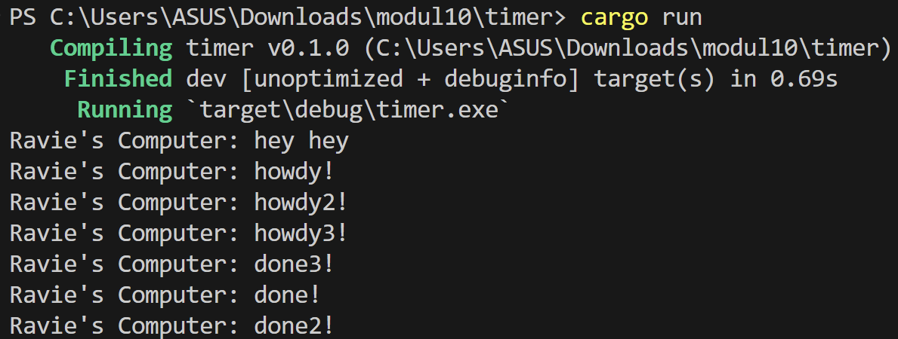

# Reflection Notes

### 1.2. Understanding how it works

Dapat dilihat bahwa pada struktur file main.rs, `println!("Ravie's Computer: hey hey");` berada setelah `spawner.spawn(...)`. Namun, jika dilihat pada screenshot output, "Ravie's Computer: hey hey" muncul lebih dahulu. Hal ini terjadi karena "Ravie's Computer: hey hey" berada di luar async block. Maka dari itu, akan langsung dieksekusi tanpa dimasukkan ke queue eksekusi. Di sisi lain, statements yang berada pada async block baru akan dieksekusi ketika berada di line `executor.run();` yang berada setelah `println!("Ravie's Computer: hey hey");`. Hence, output yang diterima adalah "Ravie's Computer: hey hey" terlebih dahulu (di luar block async), baru setelah itu block async akan dijalankan yang kemudian menghasilkan output "Ravie's Computer: howdy!" dan "Ravie's Computer: done!".

### 1.3. Multiple Spawn and removing drop

Dapat dilihat bahwa urutan eksekusi statementnya dimulai dari howdy -> howdy2 -> howdy3 -> done3 -> done -> done2. Hal ini terjadi karena ada lebih banyak task yang disimpan di queue. Penghapusan statement `drop(spawner);` menyebabkan program tidak terminate (selalu running). Hal ini terjadi karena fungsi `drop(spawner);` sendiri adalah untuk memberi tahu executor bahwa telah selesai dan tidak akan menerima task lagi kedepannya. Dengan demikian, penghapusan tersebut menjadikan executor tetap stand by terhadap task baru kedepannya karena tidak diberitahu bahwa sudah tidak ada task lagi (tidak didrop). Executor sendiri akan enqueue task dari queue yang ada, kemudian mengeksekusi task tersebut. Setelah task tersebut selesai, executor akan enqueue task selanjutnya (jika masih ada), dan mengeksekusinya. Hal ini terus berjalan hingga akhirnya queue kosong (semua task telah selesai dieksekusi).
